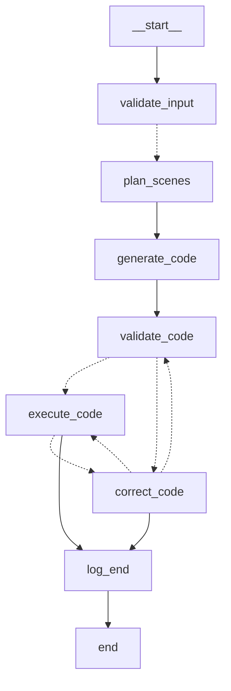

# Update : I've decided to release a series of videos where I build out this project step by step in notebooks, explaining my thought process. 
I'll update the notebooks in the instructional_notebooks/ folder and post the corresponding links to the videos that walkthrough them:

1) Build a basic working prototype from scratch

- Notebook: https://colab.research.google.com/drive/1bmeGTQ7p9qKRwCaCzckWkC4jbwhAouhp?usp=sharing

- Video : https://youtu.be/tmlErq34-OM?si=gfrZ6GL9LlsDMD56

2) Orchestrate the workflow in Langgraph

- Notebook: https://colab.research.google.com/drive/1ubPLnabhPduTPplYkXIFJxH20e4rKpcI?usp=sharing

- Video: https://youtu.be/gjxDoGyfXV8?si=CCtgLPPQee_RDdU2

# Leap

[](https://askleap.ai)
[](CONTRIBUTING.md)

Leap is an open-source tool to generate animations for any topic or question. Currently it uses the Manim animation engine along with synchronized narration, but future plans include integrating it with other libraries as well. A simple alpha is deployed, where you can simply ask your question, and Leap will create a custom, visually engaging animated explanation with synchronized narration tailored to your preferred knowledge level.

**[✨ Try the public alpha at askleap.ai ✨](https://askleap.ai)**


##  Table of Contents

- [Features](#features)
- [Architecture & System Design](#architecture--system-design)
- [Installation & Setup](#installation--setup)
- [Project Structure](#project-structure)
- [Core Components](#core-components)
- [API Documentation](#api-documentation)
- [Contributing](#contributing)
- [Roadmap & Future Plans](#roadmap--future-plans)
- [Known Limitations & Areas for Improvement](#known-limitations--areas-for-improvement)
- [Acknowledgments](#acknowledgments)

##  Features

- **Custom Animated Explanations**: Generate educational animations from text prompts on any topic
- **Multiple Explanation Levels**: Choose between ELI5 (simple), Normal, or Advanced explanations
- **Intelligent Input Processing**: Reformulates vague questions into clear, specific queries to produce better animations
- **User-Friendly Validation**: Provides helpful suggestions to improve unclear questions rather than rejecting them
- **Asynchronous Processing**: Submit requests and receive notifications when animations are ready
- **Email Notifications**: Get notified via email when your animation is complete
- **Video Playback**: Watch, share, and rate generated animations
- **Persistent Storage**: Animations are stored for future reference and sharing
- **Retro-Inspired UI**: Engaging and intuitive user interface with a unique aesthetic

##  Architecture & System Design

### System Architecture Diagram

```
                              ┌─────────────────┐
                              │                 │
                              │  React Frontend │
┌──────────┐   HTTP Requests  │  (TypeScript)   │
│          │◄─────────────────┤                 │
│          │                  └─────────────────┘
│  FastAPI │
│  Backend ├──┐              ┌───────────┐
│          │  │              │           │
│          │  │ Triggers     │ SendGrid  │──► User Emails
└────┬─────┘  │ Notification │           |
     │        └─────────────►│           │
     │                       └───────────┘
     │
     │ Animation                 ┌─────────────────┐
     │ Pipeline                  │                 │
     ├─────────────────────────► │  LangGraph      │
     │                           │  Workflow       │
     │                           └────────┬────────┘
     │                                    │
     │                                    ▼
     │                           ┌─────────────────┐
     │                           │                 │
     │                           │  Manim Engine   │
     │                           │  (Animation     │
     │                           │  Generation)    │
     │                           │                 │
     │                           └────────┬────────┘
     │                                    │
     │ Stores/Retrieves                   │
     ▼                                    ▼
┌─────────────┐             Generated animations
│             │                stored in
│  Supabase   │◄───────────────────────────┘
│  Storage    │
│             │
└─────────────┘
```

### Animation Workflow Graph

The following diagram illustrates the orchestration flow of the animation generation process in Leap:




1. **Input Validation**: Ensures the prompt and parameters are valid
   - Provides helpful reformulations for vague queries
   - Offers specific suggestions to improve unclear inputs 
   - Uses the reformulated question internally for better results
   - Creates a more user-friendly experience through constructive feedback
2. **Scene Planning**: Breaks down the explanation into logical scenes
3. **Code Generation**: Generates Manim code for the animation
4. **Code Validation**: Validates generated code for correctness
5. **Animation Execution**: Renders the animation using Manim
6. **Error Handling**: Attempts to correct errors in a feedback loop

### Data Flow

1. **User Input**: User submits a question/topic with desired explanation level through the React frontend
2. **Request Processing**: FastAPI backend receives the request and creates an animation job
3. **Asynchronous Processing**: Background task starts the LangGraph workflow
4. **Animation Generation**:
   - Input validation
   - Scene planning
   - Manim code generation
   - Code validation
   - Animation rendering
   - Error recovery
5. **Storage**: Generated animations are stored in Supabase
6. **Notification**: User is notified via email when the animation is ready (handled by SendGrid)
7. **Delivery**: User views the animation through the web interface

### Asynchronous Processing Architecture

Leap uses FastAPI's background tasks for handling the animation generation process asynchronously. Here's how the system manages concurrent requests:

#### Components and Their Concurrency Models:

1. **FastAPI Server**: 
   - Uses asynchronous request handling
   - Can accept multiple incoming requests without blocking
   - Limited by the number of worker processes in the uvicorn/gunicorn server

2. **Background Tasks**:
   - Initiated by the API server
   - Run in separate threads within the same process
   - Not truly parallel due to Python's Global Interpreter Lock (GIL)

3. **LangGraph Workflow**:
   - CPU and memory intensive
   - Occupies a worker thread during execution
   - Not designed for high concurrency within a single container

4. **Manim Rendering**:
   - Highly CPU and memory intensive
   - Uses external processes (partially bypassing the GIL)
   - Requires significant system resources

#### Potential Bottlenecks:

1. **Resource Contention**: When multiple LangGraph workflows run concurrently, they compete for CPU and memory resources, potentially slowing down all workflows.

2. **Worker Thread Saturation**: If all worker threads are busy processing animations, new incoming requests (even for the frontend UI) may be delayed until a worker becomes available.

3. **Container Resource Limits**: Docker containers have finite resources; when Manim rendering consumes most available resources, the container may become unresponsive to new requests.

#### Current Solutions:

1. **Docker Scaling**: Using multiple container replicas in production (set in docker-compose.yml)
2. **Nginx Load Balancing**: Distributing requests across multiple backend instances
3. **Background Processing**: Moving heavy computation off the main request thread

#### Best Practices When Deploying:

1. **Adequate Resources**: Ensure Docker containers have sufficient CPU and memory
2. **Proper Scaling**: Use enough replicas to handle expected load
3. **Monitoring**: Watch for resource exhaustion and performance degradation
4. **Queue Management**: Consider implementing a proper job queue for high-volume deployments

This architecture works well for moderate loads but may require additional infrastructure like dedicated worker services (e.g., Celery) for production environments with high traffic.

## Installation & Setup

### Prerequisites

- Python 3.11+ (for non-Docker development only)
- Node.js 18+ (for non-Docker development only)
- Docker & Docker Compose (recommended for all users)
- FFmpeg (for non-Docker development only)
- LaTeX (for non-Docker development only, required by Manim)
- API keys for:
  - OpenAI
  - Supabase
  - SendGrid (optional, for email notifications)

### Recommended: Docker Setup (Preferred Method)

We **strongly recommend** using Docker for both development and deployment. This approach eliminates the complex dependency setup required for Manim and ensures consistent behavior across different environments.

#### 1. Clone the Repository

```bash
git clone https://github.com/sid-thephysicskid/leap.git
cd leap
```

#### 2. Configure Environment Variables

```bash
cp .env.example .env
# Edit .env file to add your API keys and configuration
```

#### 3. Docker Compose Configuration

Leap uses multiple Docker Compose configurations for different environments:

- **docker-compose.yml**: Base configuration, defines the core services
- **docker-compose.override.yml**: Local development overrides (automatically used with `docker-compose up`)

The override file makes two key changes for local development:
- Sets the number of backend replicas to 1 (instead of 8 in production)
- Disables the Nginx service and exposes the backend directly

#### 4. Local Development with Docker

For local development, simply run:

```bash
docker-compose up --build
```

This command:
- Combines the base and override files automatically
- Builds the application image with all dependencies
- Starts a single replica of the backend service
- Exposes the application directly on port 8000
- Mounts local directories for real-time code changes

Access the application at `http://localhost:8000`

#### 5. Production Deployment with Docker

For production deployments:

```bash
# Use only the base configuration (ignoring the override file)
docker-compose -f docker-compose.yml up -d
```

This command:
- Uses only the base docker-compose.yml file
- Starts 8 backend replicas for load distribution
- Enables Nginx as a reverse proxy and load balancer
- Runs in detached mode (-d flag)

### Understanding Multiple Replicas and Nginx

In production, we use multiple replicas and Nginx for several reasons:

1. **Improved Throughput**: Multiple replicas can handle more concurrent requests
2. **High Availability**: If one replica fails, others continue serving requests
3. **Resource Isolation**: Each animation generation job runs in its own container
4. **Load Balancing**: Nginx distributes incoming requests across replicas
5. **Efficient Resource Usage**: Better utilization of available CPU/memory

The animation generation process is CPU and memory intensive. By using multiple replicas, we avoid having a single container become unresponsive when processing complex animations.

### Deploying on EC2

To deploy Leap on an EC2 instance:

1. **Launch an EC2 instance** with sufficient resources:
   - Recommended: at least 4 vCPUs and 8GB RAM
   - Ubuntu Server 20.04 or later

2. **Install Docker and Docker Compose**:
   ```bash
   sudo apt-get update
   sudo apt-get install -y docker.io docker-compose
   sudo usermod -aG docker $USER
   # Log out and back in for changes to take effect
   ```

3. **Clone the repository and configure**:
   ```bash
   git clone https://github.com/sid-thephysicskid/leap.git
   cd leap
   cp .env.example .env
   # Edit .env and set BASE_URL to your EC2 public DNS or IP
   ```

4. **Start the application in production mode**:
   ```bash
   docker-compose -f docker-compose.yml up -d
   ```

5. **Configure security groups** to allow inbound traffic on port 8000

6. **Set up a domain name and SSL** (recommended for production):
   - Register a domain and point it to your EC2 instance
   - Install and configure Certbot for SSL certificates
   - Update Nginx configuration to use the SSL certificates

### Troubleshooting Docker Deployments

- **Container resource limits**: Ensure your Docker host has sufficient CPU and memory
- **Swapping behavior**: Add swap space if your EC2 instance has limited memory
- **Logs**: Check container logs with `docker-compose logs -f leap`
- **Scaling**: Adjust the number of replicas in docker-compose.yml based on your server capacity

### Alternative: Manual Setup (Advanced Users)

If you prefer not to use Docker, you can set up the environment manually. Be aware that Manim has complex dependencies and may require additional troubleshooting.

#### Backend Setup

1. **Install System Dependencies**:

   For Ubuntu/Debian:
   ```bash
   sudo apt-get update
   sudo apt-get install -y \
       ffmpeg \
       libcairo2-dev \
       libpango1.0-dev \
       texlive-full \
       python3-pip \
       python3-venv
   ```

   For macOS:
   ```bash
   brew install ffmpeg cairo pango texlive
   ```

   For Windows, we recommend using WSL2 (Windows Subsystem for Linux) or Docker instead.

2. **Create and Activate a Virtual Environment**:
   ```bash
   python3 -m venv venv
   source venv/bin/activate  # On Windows: venv\Scripts\activate
   ```

3. **Install Backend Package**:
   ```bash
   cd backend
   pip install -e .  # Installs in development mode with all dependencies
   ```

4. **Configure Environment Variables**:
   ```bash
   cd ..  # Return to project root
   cp .env.example .env
   # Edit .env file with your API keys and configuration
   ```

#### Frontend Setup

1. **Install Node.js Dependencies**:
   ```bash
   cd frontend
   npm install
   ```

2. **Build the Frontend**:
   ```bash
   npm run build
   # This creates optimized production files in the dist/ directory
   ```

   For development with hot reloading:
   ```bash
   npm run dev
   ```

#### Running the Application

1. **Start the API Server**:
   ```bash
   cd backend
   uvicorn leap.api_server:app --host 0.0.0.0 --port 8000 --reload
   ```

   This starts the FastAPI server in development mode with auto-reload enabled.

2. **Access the Application**:
   
   If you ran `npm run build` for the frontend:
   - Open your browser to `http://localhost:8000`
   
   If you ran `npm run dev` for the frontend:
   - The backend API is available at `http://localhost:8000`
   - The frontend dev server runs at `http://localhost:5173` (or other port shown in the console)

#### Using Leap from the Command Line

Leap can also be used directly from the command line to generate animations:

1. **Ensure your virtual environment is activated**:
   ```bash
   source venv/bin/activate  # On Windows: venv\Scripts\activate
   ```

2. **Run Leap with a prompt**:
   ```bash
   # After installation, you can use the leap command directly
   leap run "Explain the concept of derivatives in calculus" --level normal
   
   # Alternatively, you can use the module syntax
   python -m leap.main run "Explain the concept of derivatives in calculus" --level normal
   ```

   Available options:
   ```
   "prompt"     The explanation topic (required, first positional argument)
   --level      Explanation level: ELI5, normal, or advanced (default: normal)
   --quality    Rendering quality: low, medium, or high (default: low)
   --voice      Voice model: nova, alloy, echo, fable, onyx, shimmer (default: nova)
   --email      Email for notifications (optional)
   ```

3. **Visualize the Workflow Graph** (Developer Tool):
   ```bash
   # Generate a PNG visualization of the LangGraph workflow
   python -m leap.main visualize-workflow --output workflow_graph.png
   ```
   This command generates a visualization of the LangGraph workflow, helpful for developers to understand the architecture.

4. **View Generated Animations**:
   
   The generated animations will be saved in the `generated/` directory in the project root.

#### Troubleshooting Manual Installation

- **LaTeX Issues**: Manim requires LaTeX for rendering mathematical equations. If you encounter LaTeX-related errors:
  ```bash
  # For minimal LaTeX installation instead of texlive-full
  sudo apt-get install texlive texlive-latex-extra texlive-fonts-extra texlive-latex-recommended texlive-science
  ```

- **Cairo/Pango Errors**: These are required for vector graphics rendering:
  ```bash
  # Verify the installation
  pkg-config --libs pango cairo
  ```

- **FFmpeg Problems**: Required for video rendering:
  ```bash
  # Check if FFmpeg is properly installed
  ffmpeg -version
  ```

- **Python Dependencies**: If you encounter issues with specific Python packages:
  ```bash
  pip install --upgrade pip
  pip install -e ".[dev]"  # Install with development dependencies
  ```

#### Performance Considerations

When running without Docker, be aware that:

1. Animation generation is resource-intensive and may slow down your computer
2. You won't have the advantage of multiple replicas for handling concurrent requests
3. Consider increasing your system's swap space if you have limited RAM
4. For production deployment, Docker is still the recommended approach

##  Project Structure

```
leap/
├── backend/                 # Python backend code
│   ├── leap/                # Main package
│   │   ├── api/             # FastAPI application and routes
│   │   ├── core/            # Core functionality and configuration
│   │   ├── models/          # Data models
│   │   ├── prompts/         # LLM prompts for animation generation
│   │   ├── services/        # Business logic services
│   │   ├── templates/       # HTML templates for emails, etc.
│   │   ├── tools/           # Utility tools
│   │   └── workflow/        # LangGraph workflow definition
│   ├── tests/               # Unit and integration tests
│   └── setup.py             # Package installation script
│
├── frontend/                # React/TypeScript frontend
│   ├── public/              # Static assets
│   ├── src/                 # Source code
│   │   ├── api/             # API client
│   │   ├── components/      # React components
│   │   ├── hooks/           # React hooks
│   │   ├── lib/             # Utility functions
│   │   └── pages/           # Page components
│   └── package.json         # Node.js dependencies
│
├── docs/                    # Documentation
├── generated/               # Generated animations (local development)
├── tools/                   # Development and deployment tools
├── .env.example             # Example environment variables
├── docker-compose.yml       # Production Docker configuration
├── docker-compose.override.yml # Local development Docker configuration
├── Dockerfile               # Docker build instructions
└── README.md                # Project documentation
```

##  Testing

Leap includes a test suite to ensure reliability and correctness of the codebase. Currently. the test suite is designed to be fast and efficient, focusing on the most critical components.

### Test Coverage

The current test suite covers:

- **Unit Tests**: Individual components like GraphState, configuration, workflow nodes, input validation, and utility functions
- **Integration Tests**: Interactions between workflow nodes and API components
- **API Tests**: Basic API functionality and endpoints

End-to-end (e2e) tests that run the complete animation generation pipeline are **disabled by default** as they:
- Take several minutes to run
- Require OpenAI API access
- Need a complete Manim setup with all dependencies
- Consume significant computational resources

### Running Tests

To run the test suite:

```bash
# From the backend directory
cd backend

# Run all tests except e2e tests (recommended for development)
python -m tests.run_tests --no-e2e

# Run tests with verbose output
python -m tests.run_tests --no-e2e -v

# Generate coverage report
python -m tests.run_tests --no-e2e --coverage
```

### Areas for Test Improvement

Future test improvements should focus on:

1. **Mocked API Tests**: More comprehensive API tests with mocked dependencies to reduce runtime
2. **Frontend Testing**: Adding React component and integration tests
3. **Performance Testing**: Benchmarks for animation generation under different loads
4. **Stress Testing**: Evaluating system behavior under high concurrency

For detailed information about the test suite, including how to write new tests and troubleshoot common issues, see the [tests/README.md](backend/tests/README.md) file.

##  Core Components

### Backend Components

#### API Server (`leap/api/`)

The FastAPI server handles HTTP requests, manages animation jobs, and serves the frontend application in production. Key endpoints include:

- **POST /api/animations/generate**: Create a new animation job
- **GET /api/animations/status/{job_id}**: Check the status of an animation job
- **GET /api/animations/video/{job_id}**: Stream a generated animation
- **POST /api/feedback**: Submit user feedback for an animation


#### Intelligent Input Processing System

Leap uses an advanced validation and reformulation system to handle user inputs:

1. **Basic Validation**: Checks for minimum length (10 chars) and maximum length (140 chars)

2. **Semantic Validation**: Uses LLMs to determine if the input is:
   - VALID: Clear and specific enough for animation
   - NEEDS_CLARIFICATION: Potentially valid but vague or ambiguous
   - INVALID: Unsuitable for animation (too short, offensive, etc.)

3. **Question Reformulation**: For every input, the system generates a clearer, more specific version that maintains the original intent but is better suited for animation generation

4. **User Guidance**: For unclear inputs, instead of simply rejecting them, the system:
   - Suggests what the user might have meant ("Did you mean: [reformulation]?")
   - Offers specific improvements
   - Provides example questions that would work better

5. **Internal Optimization**: Even if the original question is accepted, the system uses the reformulated version internally, ensuring higher quality animations regardless of how the question was phrased

This approach creates a more forgiving, user-friendly experience while simultaneously improving the quality of generated animations.

#### Storage Service (`leap/services/storage_service.py`)

Manages the storage and retrieval of generated animations, with support for:
- Local filesystem storage (development)
- Supabase storage (production)

#### Notification Service (`leap/services/notification_service.py`)

Handles sending notifications to users when animations are complete, using:
- Email notifications via SendGrid
- In-app notifications

### Frontend Components

#### Animation Request Form (`frontend/src/components/AnimationForm.tsx`)

Collects user input for animation generation, including:
- Topic/question prompt
- Explanation level (ELI5, Normal, Advanced)
- Email for notifications

#### Animation Player (`frontend/src/components/VideoPlayer.tsx`)

Displays completed animations with playback controls and feedback options.

#### Job Status Tracker (`frontend/src/components/JobStatus.tsx`)

Shows the current status of animation jobs, including:
- Pending jobs
- Processing status
- Completion estimates

##  API Documentation

### Animation Endpoints

#### Generate Animation

```
POST /api/animations/generate
```

Request body:
```json
{
  "prompt": "Explain how quantum entanglement works",
  "level": "normal",
  "email": "user@example.com"
}
```

Response:
```json
{
  "job_id": "123e4567-e89b-12d3-a456-426614174000",
  "status": "queued",
  "message": "Animation generation started"
}
```

#### Check Animation Status

```
GET /api/animations/status/{job_id}
```

Response:
```json
{
  "job_id": "123e4567-e89b-12d3-a456-426614174000",
  "status": "processing",
  "progress": 0.5,
  "message": "Rendering animation"
}
```

#### Get Animation Video

```
GET /api/animations/video/{job_id}
```

Returns the video file stream.

#### Submit Feedback

```
POST /api/feedback
```

Request body:
```json
{
  "job_id": "123e4567-e89b-12d3-a456-426614174000",
  "rating": 5,
  "comments": "This explanation was very helpful!"
}
```

##  Contributing

We welcome contributions from the community! Here's how you can help improve Leap:

### Development Workflow

1. **Fork the repository** and clone it locally
2. **Create a new branch** for your feature or bugfix: `git checkout -b feature/your-feature-name`
3. **Make your changes** and write tests if applicable
4. **Test your changes** locally
5. **Commit your changes** with clear, descriptive commit messages
6. **Push to your fork** and submit a pull request

### Setting Up for Development

Follow the installation instructions above, and additionally:

1. Install development dependencies:
   ```bash
   cd backend
   pip install -e ".[dev]"
   ```

2. Run tests:
   ```bash
   pytest
   ```

### Areas for Contribution

- **GPU Rendering**: Highest latency contributor to this application is rendering the videos on CPU, which is the default renderer for Manim. Those minutes can be transformed into seconds if we can reliably render them on GPU. Here's a good place to start https://aquabeam.me/manim/opengl_guide/
- **Manim Extensions**: Manim has tons of extensions that can be leveraged here to make animations more specialized for different domains, such as:
  - **ManimPango**: For improved text rendering and typography
  - **ManimSlides**: For presentation-style animations
  - **Manim Chemistry**: For chemical structures and reactions
  - **Manim Physics**: For physics simulations and visualizations
  - **Manim ML**: For machine learning concept illustrations
- **Documentation**: Improve existing docs or add tutorials
- **Testing**: Expand test coverage


## 🔍 Known Limitations & Areas for Improvement

In the spirit of open-source transparency, here are some current limitations and areas we're working to improve:

1. **Animation Generation Time**: The process can take several minutes depending on complexity
   - *Future improvement*: Implement caching and pre-generation of common topics

2. **Error Handling**: Complex animations occasionally fail during generation
   - *Future improvement*: Enhance error recovery and provide more graceful fallbacks. A careful RAG implementation leveraging manim's source code syntax tree would benefit the model to produce less errors and recover faster.

3. **Limited Animation Styles**: Currently focuses on a single visual style
   - *Future improvement*: Implement theme selection and customization options

4. **Scalability Challenges**: The current architecture will face scalability issues with high traffic. 
   - *Future improvement*: Implement better job queuing and worker distribution. Decouple frontend and backend.

5. **Testing Coverage**: More comprehensive testing is needed
   - *Future improvement*: Expand unit and integration test coverage


##  Acknowledgments

- [Manim](https://github.com/ManimCommunity/manim): The Mathematical Animation Engine that powers our animations
- [FastAPI](https://fastapi.tiangolo.com/): The high-performance web framework used for our backend
- [React](https://reactjs.org/): The frontend library that powers our UI
- [LangGraph](https://github.com/langchain-ai/langgraph): For workflow orchestration
- [OpenAI](https://openai.com/): For powering our animation content generation
- [Supabase](https://supabase.io/): For database and storage solutions
- All our contributors and early users who have provided valuable feedback

---

<p align="center">
  <a href="https://askleap.ai">Try Leap</a> •
  <a href="https://github.com/sid-thephysicskid/leap/issues">Report Bug</a> •
  <a href="https://github.com/sid-thephysicskid/leap/issues">Request Feature</a>
</p> 